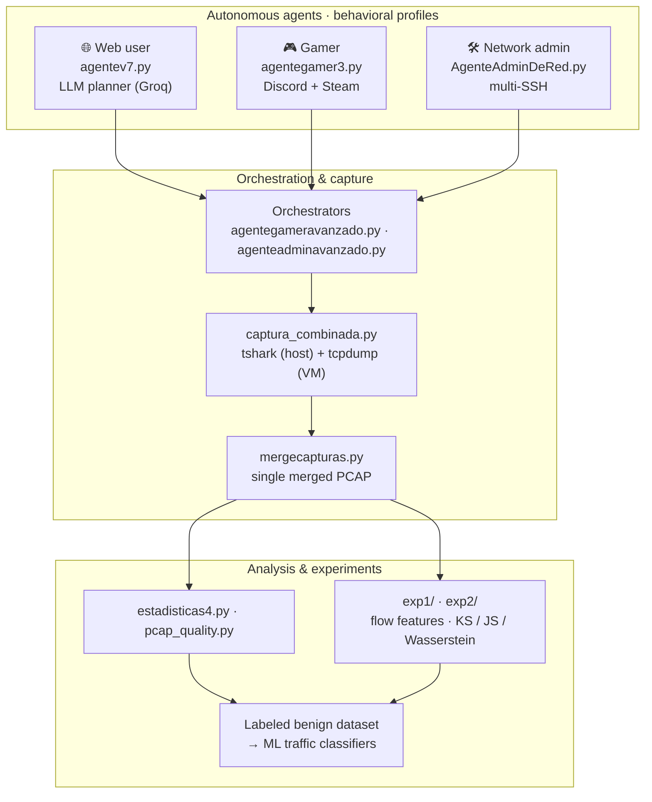
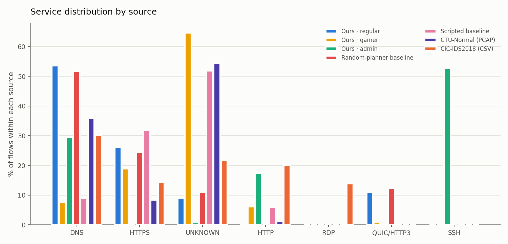

<h1 align="center">Labeled Benign Network Traffic Generation with Autonomous Agents</h1>

<p align="center">
  <em>Master's Thesis (TFM)</em><br>
  Simulating human network behavior to train AI/ML traffic classifiers.
</p>

<p align="center">
  
  
  
</p>

---

## 📌 Goal

Public network-traffic datasets are usually imbalanced: attack samples abound,
but **benign** traffic is scarce, poorly varied, or low-quality synthetic. This
project generates **realistic, labeled benign traffic** by running autonomous
agents that mimic three distinct user profiles, capturing their traffic to PCAP,
and extracting flow-level features to feed classification models.

The central idea: **what leaves a characteristic network fingerprint is the
_agent_ and its _behavioral profile_**, not the sophistication of the planner.
Experiments [`exp1`](exp1/) and [`exp2`](exp2/) quantify and bound this claim.

---

## 🤖 The three agents

| Profile | Main script | What it does | Traffic it generates |
|---|---|---|---|
| 🌐 **Web user** | [`agentev7.py`](agentev7.py) | An **LLM planner** (Groq · Llama 4 Scout) decides actions: Google searches, YouTube, email, streaming, Twitter/X. Browses with `undetected-chromedriver` and a persistent profile. | HTTPS/QUIC, DNS, TLS, CDN and video traffic |
| 🎮 **Gamer** | [`agentegamer3.py`](agentegamer3.py) | Launches **Discord** (push-to-talk with synthetic voice via VB-CABLE) and a **Steam** game (Astroflux); replays recorded input. | Game/voice UDP, WebRTC, Steam/Discord traffic |
| 🛠️ **Network admin** | [`AgenteAdminDeRed.py`](AgenteAdminDeRed.py) | Parallel multi-**SSH** (Paramiko) over a `hosts.yaml` inventory: admin commands with human-like typing, plus out-of-SSH ICMP/DNS/HTTP. | SSH, SFTP, Syslog, ICMP, DNS, HTTP |

Each agent reads its configuration from **environment variables** (see
[`.env.example`](.env.example)), so **there are no credentials in the code**.

---

## 🏗️ Architecture



---

## 🧪 Experiments

### [`exp1/`](exp1/) — Does the LLM planner add value?

Changing **only the planner** while keeping everything else constant, it compares
three ways of deciding the web agent's actions:

| Planner | Description |
|---|---|
| `llm` | The current one (Groq / Llama 4 Scout, temp. 0.2) |
| `random` | Uniform sampling from the same action catalog |
| `rule` | Fixed cyclic 8-step script |

**Result:** the agent's traffic **does separate** from a simple browserless
script, but the LLM planner is **not** distinguishable from a random one using
the same browser (KS D = 0.036). → Details in [`exp1/README.md`](exp1/README.md).

### [`exp2/`](exp2/) — Plausibility against real datasets

Using the **same feature extractor**, it contrasts our three profiles against a
simple internal baseline and **two public benign datasets** (Stratosphere
CTU-Normal-7 and CSE-CIC-IDS2018). It measures distribution distances
(KS, Jensen–Shannon, Wasserstein) over 12 flow features.

**Bounded claim:** our traffic separates from the simple baseline and its
distributions fall within **plausible ranges** relative to real benign traffic —
it is *not* claimed to replicate enterprise traffic. → Details and an honest
reading in [`exp2/README.md`](exp2/README.md) and
[`exp2/LIMITACIONES.md`](exp2/LIMITACIONES.md).

<p align="center">
  
  <br><sub>Service distribution per source: our three profiles vs. baselines and public datasets (exp2).</sub>
</p>

> 🔒 **Raw PCAPs** and the 342 MB public dataset are **not versioned** (see
> `.gitignore`); they are regenerated with each experiment's scripts. The repo
> ships the flow features, aggregates, plots, and documentation.

---

## 📂 Repository layout

```
tfm/
├── agentev7.py                 # 🌐 Web agent (LLM planner)            ← CURRENT
├── agentegamer3.py             # 🎮 Gamer agent (Discord + Steam)      ← CURRENT
├── AgenteAdminDeRed.py         # 🛠️ Network admin agent                ← CURRENT
├── agentegameravanzado.py      # 🎛️ Orchestrator: web + gamer in turns
├── agenteadminavanzado.py      # 🎛️ Orchestrator: admin (+optional web)
├── captura_combinada.py        # 🎬 Simultaneous PCAP capture of all agents
├── mergecapturas.py            # 🔗 Merge PCAPs with continuous timestamps
├── test_vms.py                 # ✅ VM boot & SSH connectivity check (VirtualBox)
├── grabador.py                 # ⏺️ Input sequence recorder (gamer)
│
├── estadisticas4.py            # 📊 PCAP statistics/analysis (latest version)
├── pcap_quality.py             # 📈 PCAP quality assessment
│
├── exp1/                       # 🧪 Experiment 1: LLM vs random vs rule
├── exp2/                       # 🧪 Experiment 2: plausibility vs real datasets
│
├── salidas_graficas*/          # Per-capture plots (5m/15m/1h × profile)
├── plots/                      # Aggregated plots
├── resultados*.json            # Per-session results (admin/gamer)
│
├── .env.example                # Environment-variable template
├── requirements.txt            # Python dependencies
└── README.md
```

> 🗂️ **Legacy versions.** The files `agente.py`, `agente2.py`,
> `agentev3.py`–`agentev6.py`, `AgenteNormal.py`, `agentegamer.py`,
> `agentegamer2.py`, `agenteadmin.py`, and `estadisticas.py`–`estadisticas3.py`
> are **earlier iterations** kept for thesis traceability. For real use, always
> pick the ones marked **CURRENT** above.

---

## ⚙️ Requirements & installation

**Software:** Python 3.10+, Google Chrome, [Wireshark](https://www.wireshark.org/)
(for `tshark`/`mergecap`), and optionally VirtualBox (admin agent) and
[VB-CABLE](https://vb-audio.com/Cable/) (gamer agent voice).

```bash
# 1) Clone and create a virtual environment
git clone https://github.com/Juan-Carl0Ss/tfm-traffic-agents.git tfm && cd tfm
python -m venv .venv
# Windows:  .venv\Scripts\activate     ·  Linux/macOS:  source .venv/bin/activate

# 2) Install dependencies
pip install -r requirements.txt

# 3) Configure credentials (never committed)
cp .env.example .env      # then fill in your values
```

### Configuration

| File | Purpose | Notes |
|---|---|---|
| [`.env`](.env.example) | Groq API key, Gmail/Twitter credentials, Discord IDs, durations | **Git-ignored.** Start from `.env.example` |
| `hosts.yaml` | Admin agent's SSH inventory (host, user, port, role) | **Not included** for security; create it locally |

---

## ▶️ Usage

```bash
# 🌐 Web agent (1 hour by default)
GROQ_API_KEY=... DURACION_WEB_S=3600 python agentev7.py

# 🛠️ Network admin agent (requires hosts.yaml)
RUN_DURATION_S=900 python AgenteAdminDeRed.py

# 🎛️ Orchestrator: admin + web in parallel for 1 hour
INCLUIR_WEB=1 MODO_WEB=paralelo MODO=tiempo_total TIEMPO_TOTAL_S=3600 python agenteadminavanzado.py

# 🎬 Combined PCAP capture of all agents (15 min, all profiles)
MODO_AGENTES=todos DURACION_S=900 python captura_combinada.py
```

### Analyzing the captures

```bash
python estadisticas4.py capture.pcapng      # descriptive stats + plots
python pcap_quality.py  capture.pcapng      # PCAP quality metrics
```

To reproduce the full experiments, follow the instructions in
[`exp1/README.md`](exp1/README.md) and [`exp2/README.md`](exp2/README.md).

---

## 🔐 Security & ethics

- **No credentials in the code:** everything is read from environment variables;
  `.env` and `hosts.yaml` are kept out of version control.
- The generated traffic is **benign**: browsing, gaming, routine administration.
  The project neither generates nor distributes malicious traffic.
- Public datasets (CTU, CSE-CIC-IDS2018) are used under their respective
  licenses; only their **provenance** (URLs + SHA-256) is versioned, not the data.
- Run the agents only on environments and accounts you own.

---

## 📄 License

Academic project (Master's Thesis). For research and educational use.
