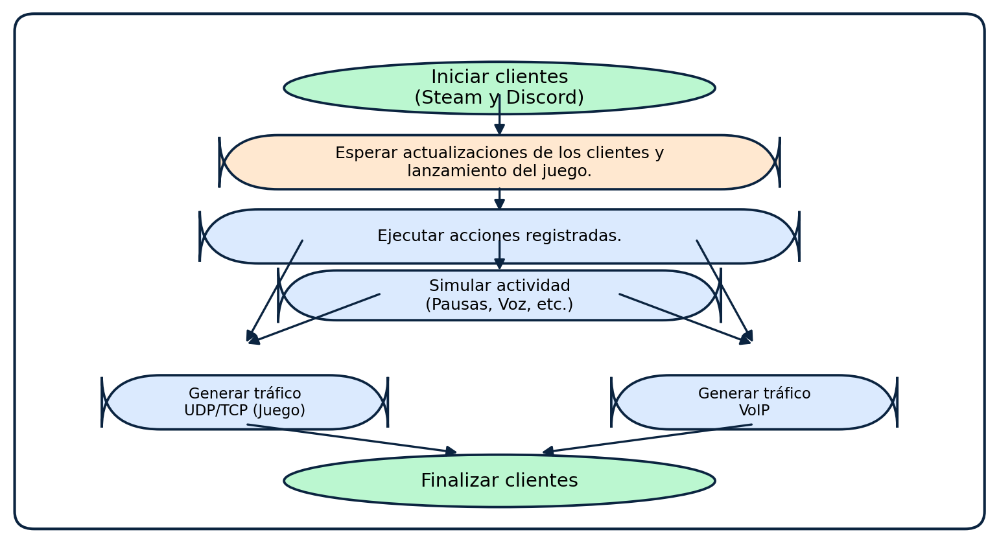
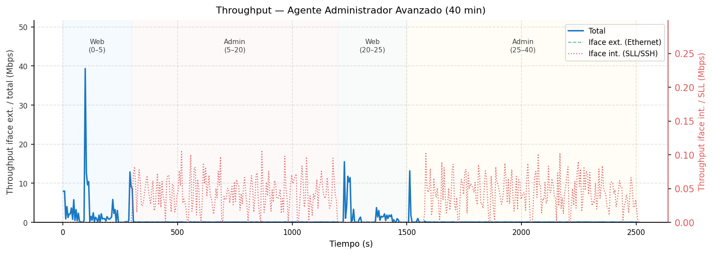
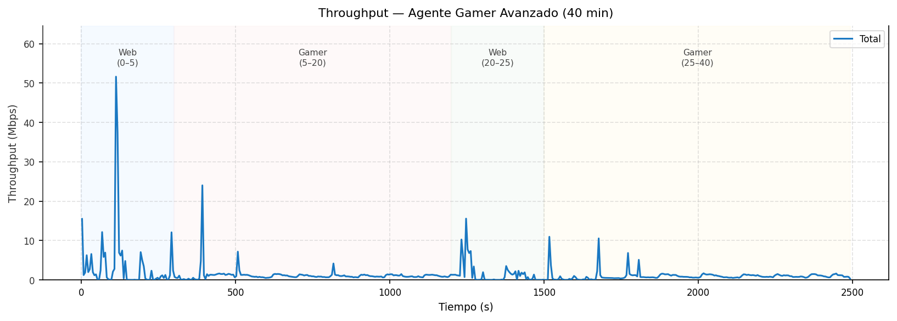

<h1 align="center">Generación de tráfico de red benigno etiquetado mediante agentes autónomos</h1>

<p align="center">
  <em>Trabajo de Fin de Máster (TFM)</em><br>
  Simulación de comportamiento humano en red para entrenar clasificadores de tráfico basados en IA/ML.
</p>

<p align="center">
  
  
  
</p>

---

## 📌 Objetivo

Los datasets públicos de tráfico de red suelen estar desbalanceados: abundan los
ejemplos de ataques, pero el tráfico **benigno** es escaso, poco variado o
sintético de baja calidad. Este proyecto genera **tráfico benigno realista y
etiquetado** ejecutando agentes autónomos que imitan tres perfiles de usuario
distintos, capturando su tráfico en PCAP y extrayendo *features* de flujo para
alimentar modelos de clasificación.

La idea central: **lo que deja huella de red característica es el _agente_ y su
_perfil de comportamiento_**, no la sofisticación del planificador. Los
experimentos [`exp1`](exp1/) y [`exp2`](exp2/) cuantifican y acotan esta afirmación.

---

## 🤖 Los tres agentes

| Perfil | Script principal | Qué hace | Tráfico que genera |
|---|---|---|---|
| 🌐 **Usuario web** | [`agentev7.py`](agentev7.py) | Un **planner LLM** (Groq · Llama 4 Scout) decide acciones: buscar en Google, ver YouTube, revisar correo, streaming, Twitter/X. Navega con `undetected-chromedriver` y perfil persistente. | HTTPS/QUIC, DNS, TLS, tráfico de CDNs y vídeo |
| 🎮 **Gamer** | [`agentegamer3.py`](agentegamer3.py) | Lanza **Discord** (voz push-to-talk con voz sintética por VB-CABLE) y un juego de **Steam** (Astroflux); reproduce input grabado. | UDP de juego/voz, WebRTC, tráfico de Steam/Discord |
| 🛠️ **Admin de red** | [`AgenteAdminDeRed.py`](AgenteAdminDeRed.py) | Multi-**SSH** paralelo (Paramiko) sobre un inventario `hosts.yaml`: comandos de administración con tecleo humano, más ICMP/DNS/HTTP fuera de SSH. | SSH, SFTP, Syslog, ICMP, DNS, HTTP |

Cada agente lee su configuración de **variables de entorno** (ver [`.env.example`](.env.example)),
por lo que **no hay credenciales en el código**.

<p align="center">
  
  <br><sub>Esquema del agente administrador de red (multi-SSH sobre VMs).</sub>
</p>

---

## 🧪 Experimentos

### [`exp1/`](exp1/) — ¿Aporta valor el planner LLM?

Compara, cambiando **solo el planner** y manteniendo todo lo demás constante,
tres formas de decidir las acciones del agente web:

| Planner | Descripción |
|---|---|
| `llm` | El actual (Groq / Llama 4 Scout, temp. 0.2) |
| `random` | Muestreo uniforme del mismo catálogo de acciones |
| `rule` | Guion cíclico fijo de 8 pasos |

**Resultado:** el tráfico del agente **sí se separa** de un script simple sin
navegador, pero el planner LLM **no** se distingue de uno aleatorio con el mismo
navegador (KS D = 0,036). → Detalle en [`exp1/README.md`](exp1/README.md).

### [`exp2/`](exp2/) — Plausibilidad frente a datasets reales

Con el **mismo extractor de features**, contrasta nuestros tres perfiles frente a
un baseline interno simple y a **dos datasets benignos públicos**
(Stratosphere CTU-Normal-7 y CSE-CIC-IDS2018). Mide distancias de distribución
(KS, Jensen-Shannon, Wasserstein) sobre 12 *features* de flujo.

**Afirmación acotada:** nuestro tráfico se separa del baseline simple y sus
distribuciones caen en **rangos plausibles** frente al tráfico benigno real —
*no* se afirma que replique tráfico empresarial. → Detalle y lectura honesta en
[`exp2/README.md`](exp2/README.md) y [`exp2/LIMITACIONES.md`](exp2/LIMITACIONES.md).

> 🔒 Los **PCAP crudos** y el dataset público de 342 MB **no se versionan**
> (ver `.gitignore`); se regeneran con los scripts de cada experimento. El repo
> incluye los *features* de flujo, agregados, gráficas y documentación.

<p align="center">
  
  
  <br><sub>Throughput por segundo — agente admin (izq.) y agente gamer (der.).</sub>
</p>

---

## 📂 Estructura del repositorio

```
tfm/
├── agentev7.py                 # 🌐 Agente web (LLM planner)          ← ACTUAL
├── agentegamer3.py             # 🎮 Agente gamer (Discord + Steam)     ← ACTUAL
├── AgenteAdminDeRed.py         # 🛠️ Agente admin de red                ← ACTUAL
├── agentegameravanzado.py      # 🎛️ Orquestador web + gamer por turnos
├── agenteadminavanzado.py      # 🎛️ Orquestador admin (+web opcional)
├── captura_combinada.py        # 🎬 Captura PCAP simultánea de todos los agentes
├── mergecapturas.py            # 🔗 Fusiona PCAPs con timestamps continuos
├── test_vms.py                 # ✅ Prueba arranque de VMs y SSH (VirtualBox)
├── grabador.py                 # ⏺️ Grabador de secuencias de input (gamer)
│
├── estadisticas4.py            # 📊 Análisis/estadísticas de PCAP (última versión)
├── pcap_quality.py             # 📈 Evaluación de calidad de PCAP
│
├── exp1/                       # 🧪 Experimento 1: LLM vs random vs rule
├── exp2/                       # 🧪 Experimento 2: plausibilidad vs datasets reales
│
├── salidas_graficas*/          # Gráficas por captura (5m/15m/1h × perfil)
├── plots/                      # Gráficas agregadas
├── resultados*.json            # Resultados por sesión (admin/gamer)
├── assets/                     # Imágenes del README
│
├── .env.example                # Plantilla de variables de entorno
├── requirements.txt            # Dependencias de Python
└── README.md
```

> 🗂️ **Versiones antiguas.** Los ficheros `agente.py`, `agente2.py`,
> `agentev3.py`–`agentev6.py`, `AgenteNormal.py`, `agentegamer.py`,
> `agentegamer2.py`, `agenteadmin.py` y `estadisticas.py`–`estadisticas3.py` son
> **iteraciones previas** conservadas por trazabilidad del TFM. Para uso real,
> emplea siempre las marcadas como **ACTUAL** arriba.

---

## ⚙️ Requisitos e instalación

**Software:** Python 3.10+, Google Chrome, [Wireshark](https://www.wireshark.org/)
(para `tshark`/`mergecap`), y opcionalmente VirtualBox (agente admin) y
[VB-CABLE](https://vb-audio.com/Cable/) (voz del agente gamer).

```bash
# 1) Clonar y crear entorno virtual
git clone <url-del-repo> tfm && cd tfm
python -m venv .venv
# Windows:  .venv\Scripts\activate     ·  Linux/macOS:  source .venv/bin/activate

# 2) Instalar dependencias
pip install -r requirements.txt

# 3) Configurar credenciales (nunca se suben al repo)
cp .env.example .env      # y rellena tus valores
```

### Configuración

| Fichero | Para qué | Notas |
|---|---|---|
| [`.env`](.env.example) | API key de Groq, credenciales Gmail/Twitter, IDs de Discord, duraciones | **En `.gitignore`.** Parte de `.env.example` |
| `hosts.yaml` | Inventario SSH del agente admin (host, usuario, puerto, rol) | **No incluido** por seguridad; créalo localmente |

---

## ▶️ Uso

```bash
# 🌐 Agente web (1 hora por defecto)
GROQ_API_KEY=... DURACION_WEB_S=3600 python agentev7.py

# 🛠️ Agente admin de red (requiere hosts.yaml)
RUN_DURATION_S=900 python AgenteAdminDeRed.py

# 🎛️ Orquestador admin + web en paralelo durante 1 h
INCLUIR_WEB=1 MODO_WEB=paralelo MODO=tiempo_total TIEMPO_TOTAL_S=3600 python agenteadminavanzado.py

# 🎬 Captura PCAP combinada de todos los agentes (15 min, todos los perfiles)
MODO_AGENTES=todos DURACION_S=900 python captura_combinada.py
```

### Análisis de las capturas

```bash
python estadisticas4.py captura.pcapng      # descriptivos + gráficas
python pcap_quality.py  captura.pcapng      # métricas de calidad del PCAP
```

Para reproducir los experimentos completos, sigue las instrucciones de
[`exp1/README.md`](exp1/README.md) y [`exp2/README.md`](exp2/README.md).

---

## 🔐 Seguridad y ética

- **Sin credenciales en el código:** todo se lee de variables de entorno; `.env`
  y `hosts.yaml` están fuera del control de versiones.
- El tráfico generado es **benigno**: navegación, juego, administración rutinaria.
  El proyecto no genera ni distribuye tráfico malicioso.
- Los datasets públicos (CTU, CSE-CIC-IDS2018) se usan bajo sus licencias
  respectivas; solo se versiona su **procedencia** (URLs + SHA-256), no los datos.
- Ejecuta los agentes únicamente en entornos y cuentas de tu propiedad.

---

## 📄 Licencia

Proyecto académico (TFM). Uso con fines de investigación y educativos.
